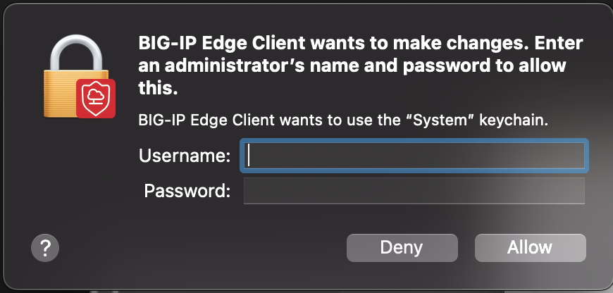

# bigip_auto

This repository contains the `bigip` tool, which provides automated functionality for BigIP authentication. 


## Installation
Create and activate virtual env

```
git clone https://github.com/tripathysagar/bigip_auto.git
cd bigip_auto
pip install .
```
### Usage
Run: `bigip`

include `-a T or --admin True` if the 
 comes up in your device

## Configuration

### macOS Accessibility Permissions

1. System Preferences > Security & Privacy > Privacy > Accessibility
2. Unlock, then check box for app running the script (e.g., Terminal)
3. Restart the application


## Important Usage Notes

Password Handling: The program is designed to securely handle your password. Instead of typing out your password multiple times, you only need to enter it once. The program will then automatically input the password when required during operations.
Do Not During Operation:

Once the program starts running, do not move the mouse or type anything.
The program uses pyautogui to take screenshots and determine the locations for performing operations.
Any interference could disrupt the automated process and lead to errors.


Screen Interaction: This tool interacts directly with your screen to perform operations. Ensure that the relevant windows are visible and not obstructed.
## Support

For issues or questions, open an issue🫡.


